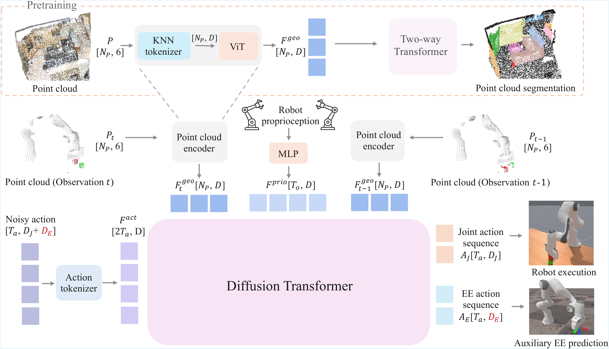

# R3D: Revisiting 3D Policy Learning
<a href="https://r3d-policy.github.io"><strong>Project Page</strong></a>
  |
  <a href="https://"><strong>Paper</strong></a>
  |
  <a href="https://"><strong>Twitter</strong></a> | <a href="Place Holder"><strong>YouTube</strong></a>

  <a href="https:// /">Zhengdong Hong*</a>, 
  <a href="https:// /">Shenrui Wu*</a>, 
  <a href="https:// /">Haozhe Cui*</a>, 
  <a href="https:// /">Shiqi Yang</a>, 
  <a href="https:// /">Boyi Zhao</a>, 
  <a href="https:// /">Ran Ji</a>, 
  <a href="https:// /">Yiyang He</a>, 
  <a href="https:// /">Hangxing Zhang</a>, 
  <a href="https:// /">Zundong Ke</a>, 
  <a href="https:// /">Jun Wang</a>, 
  <a href="https:// /">Guofeng Zhang</a>
  <a href="https:// /">Jiayuan Gu†</a>


<div align="center">
  
</div>

---

## Installation

Follow the detailed instructions in [INSTALL.md](INSTALL.md) to set up the environment and install dependencies.

---

## Download

1.Download assets

```bash
cd R3D/r3d/env/robotwin2
bash script/_download_assets.sh
cd ../../../..
```

---

2.Download pre-processed data

It might take some time, be patient!

```bash
hf download eddie-cui/r3d --repo-type dataset --local-dir ./R3D/data
```

---

3.Download pre-trained weights of vision encoder 

```bash
hf download eddie-cui/r3d-weights --local-dir ./R3D/pretrain_weight
```

---

## Guide

### Training Examples

1.RoboTwin
```bash
conda activate r3d && bash scripts/train_robotwin2_single.sh r3d_robotwin2 place_shoe 0000 0 0
# To enable DDP multi-GPU training, you only need to change GPU ID from single like "0" to multiple like "0,1" or "0,1,2"
conda activate r3d && bash scripts/train_robotwin2_single.sh r3d_robotwin2 place_shoe 0000 0 0,1
```

2.ManiSkill
```bash
conda activate r3d_maniskill && bash scripts/train_maniskill_single.sh r3d_maniskill PickCube 0000 0 0
# To enable DDP multi-GPU training, you only need to change GPU ID from single like "0" to multiple like "0,1" or "0,1,2"
conda activate r3d_maniskill && bash scripts/train_maniskill_single.sh r3d_maniskill PickCube 0000 0 0,1
```

---


